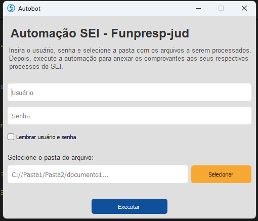

# Automação SEI Funpresp-Jud 

Automação para interação com o sistema SEI (Sistema Eletrônico de Informações) da Funpresp-Jud, facilitando a inclusão automática de documentos em processos judiciais a partir de arquivos PDF em um diretório específico.

## Funcionalidades

- Login automático no sistema SEI com credenciais do usuário.

- Busca de processos pelo número formatado.

- Inclusão automática de documentos externos em processos selecionados.

- Anexação de arquivos PDF automaticamente a partir de um diretório selecionado.

- Interface gráfica simples, desenvolvida com PyQt5, para facilitar o uso.

- Suporte a tratamento de erros com mensagens para o usuário.

- Arquivo .exe gerado para uso direto no Windows, dispensando configuração do ambiente Python para o usuário final.

## Tecnologias Utilizadas

Python 3.x

Selenium WebDriver (Chrome)

PyQt5 para interface gráfica

PyAutoGUI para interações com o sistema operacional (upload de arquivos)

Logging para registro de eventos e erros

## ▶️Como usar

### ✅Executável .exe

Para facilitar o uso, um arquivo executável já foi gerado. Basta executar o arquivo Autobot.exe (localizado na pasta 'dist') diretamente no Windows.

1. Abra o programa.

2. Insira seu usuário e senha do SEI.

3. Selecione o diretório onde estão os arquivos PDF a serem anexados.

4. Clique em Executar.

5. Aguarde a conclusão da automação. Mensagens de status serão exibidas.

###  🛠️ Executando pelo código-fonte

Se desejar executar pelo código-fonte, siga os seguintes passos:

1. Tenha Python 3.x instalado.

2. Instale as dependências necessárias:
pip install -r requirements.txt

3. Configure o driver do Chrome compatível com sua versão do navegador e o deixe no PATH do sistema ou na mesma pasta do script.

4. Execute o script principal:
python main.py

5. Informe usuário, senha e diretório conforme solicitado pela interface.

## 📄Estrutura do Projeto

├── main.py                      # Interface gráfica e controle principal da automação

├── selenium_handler.py          # Lógica de automação com Selenium e PyAutoGUI

├── icon.ico                     # Ícone da aplicação

├── AutomacaoSEI_FunprespJud.exe # Executável para Windows (gerado)

├── requirements.txt             # Lista de dependências Python

└── README.md                    # Este arquivo

## ⚠️ Observações
O uso da automação é de responsabilidade do usuário. Certifique-se de ter autorização para usar automações no sistema SEI.

Para o funcionamento adequado, o navegador Google Chrome deve estar instalado.

A automação depende da estabilidade e layout atual do sistema SEI da Funpresp-Jud; alterações no sistema podem requerer ajustes no código.

O arquivo executável é gerado via ferramentas como PyInstaller para facilitar o uso, dispensando instalação de Python e bibliotecas no computador do usuário final.

## 📬 Contato
Para dúvidas, sugestões ou problemas, entre em contato:

Desenvolvido por Samuel Lima Alves
Email: contatosamuel.lima23@gmail.com
